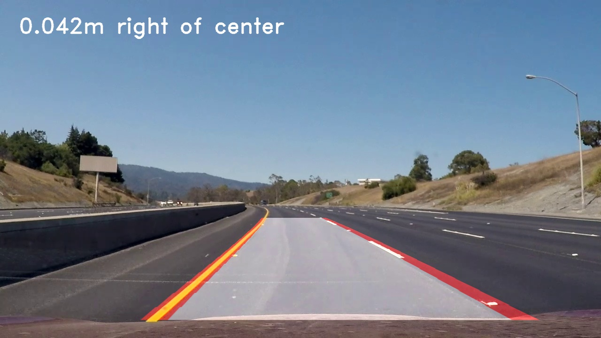
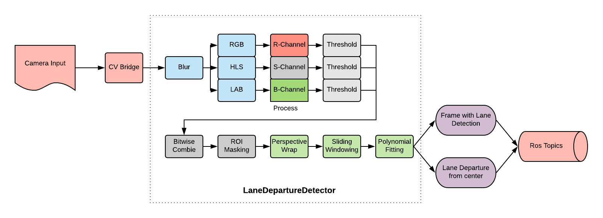

# ROS Lane Departure Warning System
In road-transport terminology, a lane departure warning system is a mechanism designed to warn the driver when the vehicle begins to move out of its lane



## Objectives
  1) Detect the lanes on the road even if they are curved
  2) Detect the departure from the center
  3) Publish the departure to ROS topic
  4) Warn the driver if the departure is above some threshold
  
The project will detect these objects(^) and will print instructions to the autonoums car

## Demo
You can download the [demo video by clicking here](teaser_video.mp4)

You can see the whole research & coding process by viewing this [python notebook](research.ipynb)

You can download the HIT poster by [clicking here](poster.pptx)

## Design



## Usage in ROS
We are providing two scripts that integrates the system into ROS:
1) `ros_video_publisher.py` - Should be used to publish the video from the file system into ROS topic called `lanes_video`.
2) `ros_lane_consumer.py` - Should be used to consume the content from the topic `lanes_video`, this script will use our system to process the input video and publish the processed image and departure from center into the following topics: `image_lane_detector`, `image_lane_departure`


So first run the `ros_video_publisher.py` and then run the `ros_lane_consumer.py`

After running these nodes you can subscribe to the departure data by subscribing to the `image_lane_departrue`, for example:

```python
def callback(data):
    data = float(data.data)
    
    # Get the departure direction:
    direction = ""
    if (data > 0):  # Right
        direction = "right"
    else:           # Left
        direction = "left"
    
    magnitude = abs(data)
    
    # Play a sound that notifies the driver 
    # if the departure is greater than 50 cm
    if (magnitude > 0.5):
        text_to_speech("Move to the " + direction)


rospy.Subscriber("image_lane_departure", String, callback)
rospy.spin()
```

## Libraries Used
* OpenCV
* RosPy
* Ros CVBridge
